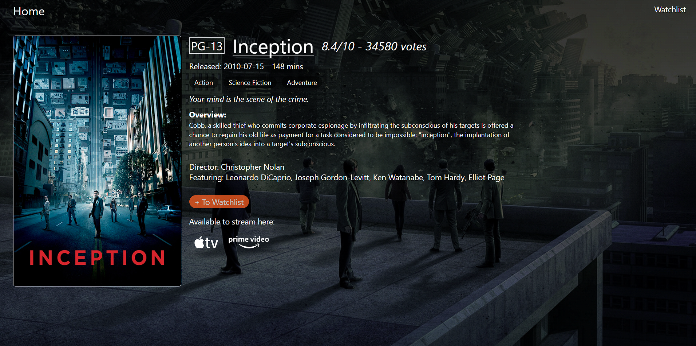
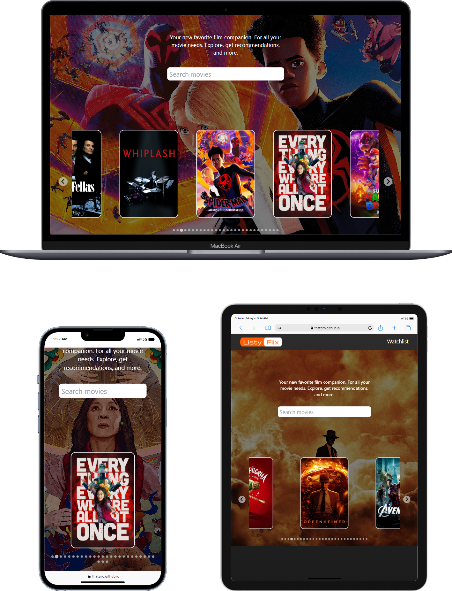

[![Contributors][contributors-shield]][contributors-url]
[![Forks][forks-shield]][forks-url]
[![Stargazers][stars-shield]][stars-url]
[![Issues][issues-shield]][issues-url]
[![MIT License][license-shield]][license-url]
[![LinkedIn][linkedin-shield]][linkedin-url]

<!-- PROJECT LOGO -->
 

  

<h3 align="center">CtrlAltDefeat</h3>

  
ListyFlix is your ultimate partner for movie night planning, ensuring a hassle-free and memorable cinematic experience with friends and family. Are you tired of spending hours searching for the perfect film to watch? ListyFlix has you covered! Our platform makes it a breeze to discover the ideal movie for your evening, providing detailed information on where to stream it. Plus, you can create personalized movie night lists to keep track of your favorite films. 
  
  Don't miss out on the convenience and fun ListyFlix brings to your movie nights. Join our community of movie enthusiasts and start planning your next movie night today.

  

  
 – Say hello to stress-free movie selection, and let the good times roll!

 
 

<h3 font size="1" align="right"><a href="https://thatziro.github.io/Listy-Flix/" target="_blank">Visit Site🚀</a></h3>

## Table of Contents

<!-- TABLE OF CONTENTS -->

  
Table of Contents

  <ol>
    <li><a href="#tech-stack">Tech Stack</a></li>
    <li><a href="#sneak-peek">Sneak Peek</a></li>
    <li><a href="#development">Development</a></li>
    <li><a href="#contact">Contact</a></li>
  </ol>

## Tech Stack

(<a href="#readme-top">back to top</a>)

<!-- GETTING STARTED -->

## Sneak Peek

### <a href="https://thatziro.github.io/Listy-Flix/" target="_blank">Visit Site</a> 🚀

(<a href="#readme-top">back to top</a>)

## Development

  
Responsive Layouts

  

  
Burndown

  

(<a href="#readme-top">back to top</a>)

## Team - CtrlAltDefeat

### Jorlyna - Designer

Email - <a href="mailto:jorlyna326@gmail.com">jorlyna326@gmail.com</a>

Github - <a href="https://github.com/jorlyna326">jorlyna326</a>

### Jared - Front End Developer

Email - <a href="mailto:jmorrison.m44@gmail.com">jmorrison.m44@gmail.com</a>

Github - <a href="https://github.com/jradmorrison">jradmorrison</a>

### Brandon - Back End Developer

Email - <a href="mailto:ImBrandonBarnes@gmail.com">imbrandonbarnes@gmail.com</a>

Github - <a href="https://github.com/ThatZiro">ThatZiro</a>

(<a href="#readme-top">back to top</a>)

<!-- MARKDOWN LINKS & IMAGES -->
<!-- https://www.markdownguide.org/basic-syntax/#reference-style-links -->

[contributors-shield]: https://img.shields.io/github/contributors/ThatZiro/Listy-Flix.svg?style=for-the-badge
[contributors-url]: https://github.com/ThatZiro/Listy-Flix/graphs/contributors
[forks-shield]: https://img.shields.io/github/forks/ThatZiro/Listy-Flix.svg?style=for-the-badge
[forks-url]: https://github.com/ThatZiro/Listy-Flix/network/members
[stars-shield]: https://img.shields.io/github/stars/ThatZiro/Listy-Flix.svg?style=for-the-badge
[stars-url]: https://github.com/ThatZiro/Listy-Flix/stargazers
[issues-shield]: https://img.shields.io/github/issues/ThatZiro/Listy-Flix.svg?style=for-the-badge
[issues-url]: https://github.com/ThatZiro/Listy-Flix/issues
[license-shield]: https://img.shields.io/github/license/ThatZiro/Listy-Flix.svg?style=for-the-badge
[license-url]: https://github.com/ThatZiro/Listy-Flix/blob/master/LICENSE.txt
[linkedin-shield]: https://img.shields.io/badge/-LinkedIn-black.svg?style=for-the-badge&logo=linkedin&colorB=555
[linkedin-url]: https://linkedin.com/in/linkedin_username
